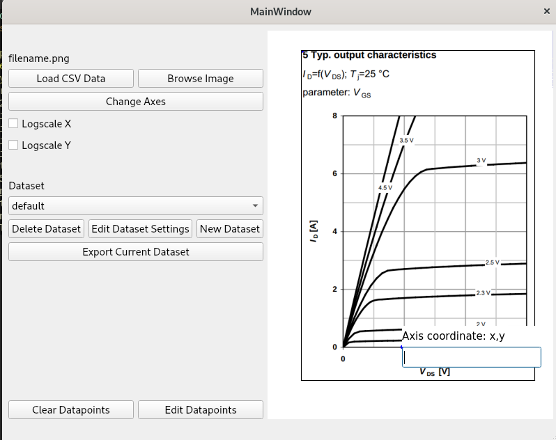
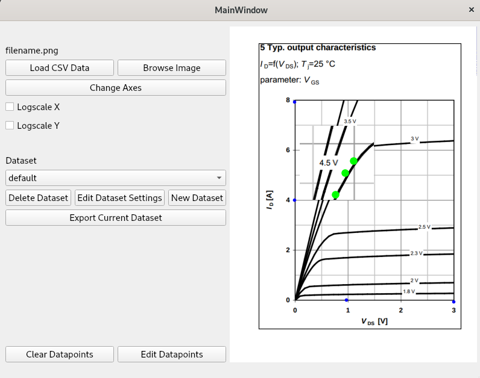
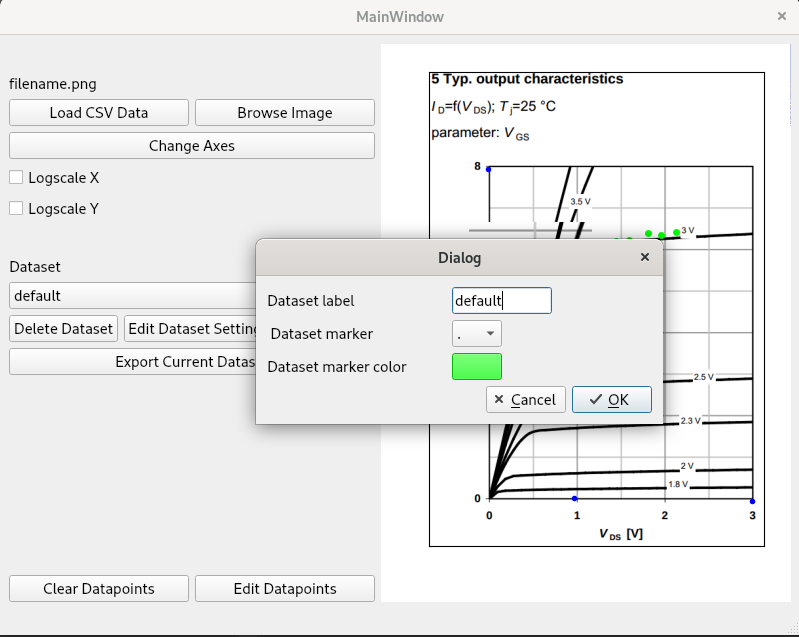
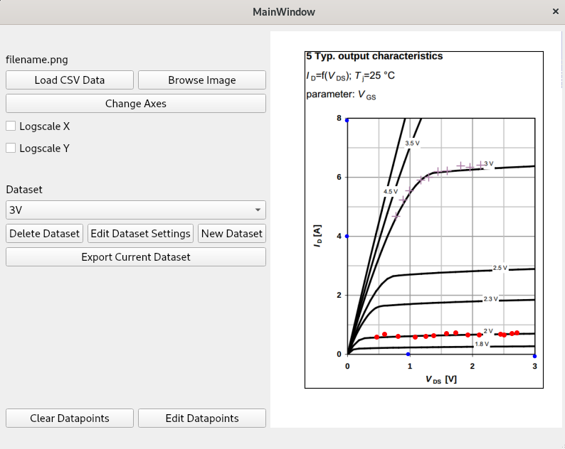

# Python Plot Digitizer

This is a plot digitizer written in Python using PyQt5 and Matplotlib. With an interface inspired partly by [WebPlotDigitizer](https://automeris.io/WebPlotDigitizer/), this app (with only 2 source files!) can handle multiple datasets with different plotting options, and can save the data, sorted, to csv. Linear, semi-log, and log-log plots are supported. 

## Quick Guide

Using the Python Plot Digitizer goes like this:

* Start up, and load the image using "Browse Image"
* Choose 4 axes points with their associated plot coordinates (these are usually two points on the x-axis and two points on the y-axis). Coordinates are entered x,y. Left click adds the next point, right click resets the previous point. Use the arrow keys to nudge points around.
* After the coordinate system is set, the transformation is calculated, and you can start adding datapoints. Left-click adds new datapoints, right-click removes the last datapoint, and the arrow keys nudge the most recent datapoint. 
* You can change the dataset settings to customize the label, marker type, and marker color. You can also add new datasets. 

### Features Not Yet Implemented

The following are not yet implemented:

* Load CSV Data - Loads a dataset onto the current image from a csv file
* Delete Dataset - Deletes a dataset
* Clear Datapoints - Remove all datapoints from a dataset
* Edit Datapoints - Select, move, or delete datapoints
* Redo - Use Ctrl-R to re-add a datapoint after deletion
* Help - A help window to remind you how to use the app

## Screenshots

